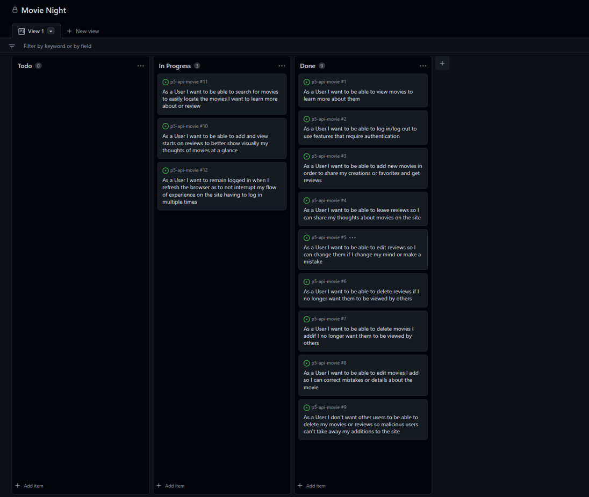
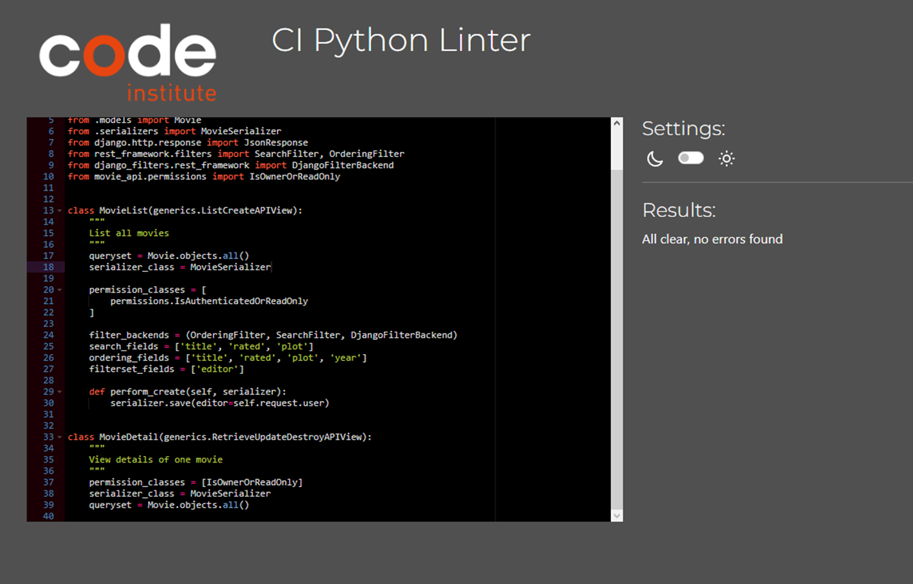

# Movie Night API

The Movie Night API was developed and is being used for the Movie Night React application. Stemming from an Imdb-esque concept of a movie review site, the Restful API provdies CRUD functionality and data persistence of movies, reviews and users.

This is documentation relating to the development of the Movie Night API.

[Deployed API](https://drf-movie-app.herokuapp.com)

[Deployed Front End](https://movie-night-p5.herokuapp.com/)

[Front End Repository](https://github.com/JavaScriptJacksn/movie-night-frontend)

## User Stories

All user stories were documented on the GitHUb projects Kanban board attached to this repository. The same User stories below were used in the development of the front-end application.

Some user stories were moved into the 'In Progress' section so they can be seen in the screenshot, but all were completed and tested.

.

## Database

The database schema is simple and effective. At the intial conceptualisation of the project more models and functionality were planned and still are for future personal additions.

Part of this reasoning was due to the removal of the free teir on Heroku. Whilst the CI were amazing at locating Elephant SQL as a suitable replacement PostgreSQL database, I took this opportunity to use mongoDB, which I had used previously with Spring Boot in Java to great success. Another bonus was the MongoDB Atlas AWS server hosting which had a free use option, along with a movie sample database that perfectly fit sample data for this project.

However, as I found out after weeks of trial and error, that even with the djongo library, despite my best efforts, Django was not yet optimised for mongoDB and roadblock after roadblock workintg with ObjectIds, almost all of the code I had to re-write.

A bitter truth I've come to learn is sometimes this is inevitable and the determination to continue down a failing path would have caused more trouble later down the line.

Nevertheless, I used Elephant SQL and it worked perfectly and was much better suited to handle relational data, something I had planned to be a small feature by design to accomodate MongoDB.

However, I still used the sample data from MongoDB Atlas 'sample_mflix' using the DRF UI and manually inputting movies which was a positive to take from this.

.

Note: The movies table should include a 'poster' field, but this was added later

## Testing

All files passed through the Code Institute python linter, with the only exceptions being line too long messages in files generated by Django, such as settings.py

.

### Manual tests performed

- Movies
- - All movie get requests to correct urls return expected results
- - All movie put requests update the correct movie and persist to the database
- - All movie delete requests delete the correct review and persist to the database
- - On the correct url, movies can be filtered and searched using query params and the DRF development UI
- Reviews
- - All reviews can be returned using a get request to the correct url
- - All review put requests update the correct movie and persist to the database
- - All review delete requests delete the correct review and persist to the database
- Authentication
- - Users can sign up and have their details securely saved to the database
- - Users are issued JWT authentication tokens and refresh tokens to allow browser sessions

### Unfixed Bugs

- None

### Fixed Bugs

- CORS 401 error
- - Solved by adding the deployed front end app domain to the CLIENT_ORIGIN enviroment variable
- Reviews not being retrieved using movie id as a query param
 - Fixed by adding 'get queryset' function to Review views.py

## Technologies Used

- Python
- Django (& associated middleware)
- PostgreSQL
- Cloudinary
- Heroku

## Deployment

### Steps for deployment

1) Create a Heroku app
2) Set the following config variables:
    - SECRET_KEY = any secret key
    - CLOUDINARY_URL = cloudinary remote media storage url
    - ALLOWED_HOST = deployed domain
    - DISABLE_COLLECTSTATIC = 1
    - CLIENT_ORIGIN = deployed front end domain
    - CLIENT_ORIGIN_DEV (only for development of the front end)
    - DATABASE_URL = ElephantSQL database connection url
3) Scroll down under the 'deploy' tab to link the app to the GitHub repository
4) Click 'deploy branch'
5) Enjoy Movie Night API